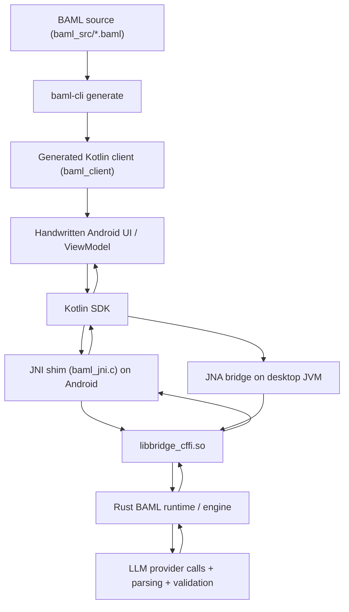

# KitchenRecipeAppBAML Architecture

This document explains how this project works end to end:

1. how BAML source becomes generated Kotlin code
2. how the Android app calls the generated code
3. how the Kotlin SDK crosses the native boundary
4. how the Rust runtime executes BAML functions
5. how Gradle packages everything into an Android app

## High-Level Overview

At a high level, this app has four layers:

1. **BAML project**
   - The source of truth for functions, prompts, schemas, and clients.
   - Lives in [`/Users/tejguntuku/AndroidStudioProjects/KitchenRecipeAppBAML/baml_src`](/Users/tejguntuku/AndroidStudioProjects/KitchenRecipeAppBAML/baml_src).

2. **Generated Kotlin client**
   - Typed wrappers and generated models for the app to call.
   - Generated into `app/src/main/java/.../baml_client`.

3. **Kotlin SDK**
   - Runtime bootstrapping, protobuf encode/decode, callback routing, and native loading.
   - Lives in the `tej_baml_kotlin` repo under `engine/language_client_kotlin`.

4. **Native Rust runtime**
   - The actual BAML execution engine.
   - Exposed through the `bridge_cffi` shared library.

The generated code is a typed frontend over the Rust runtime. It does not replace the Rust engine.

## End-to-End Flow



## Repo Roles

This app repo is only one part of the system.

### App repo

- Path: [`/Users/tejguntuku/AndroidStudioProjects/KitchenRecipeAppBAML`](/Users/tejguntuku/AndroidStudioProjects/KitchenRecipeAppBAML)
- Contains:
  - `baml_src`
  - handwritten Android UI/ViewModel code
  - app-level Gradle build
  - Android JNI shim at `app/src/main/cpp/baml_jni.c`

### BAML/Kotlin SDK repo

- Path: [`/Users/tejguntuku/TEJ/tej_baml_kotlin`](/Users/tejguntuku/TEJ/tej_baml_kotlin)
- Contains:
  - the Kotlin code generator
  - the Kotlin SDK
  - the Rust runtime and `bridge_cffi`
  - the Kotlin-capable CLI entrypoint

## Codegen Flow

Codegen starts from the BAML files in:

- [`/Users/tejguntuku/AndroidStudioProjects/KitchenRecipeAppBAML/baml_src`](/Users/tejguntuku/AndroidStudioProjects/KitchenRecipeAppBAML/baml_src)

The command used for this project is:

```bash
cd /Users/tejguntuku/TEJ/tej_baml_kotlin
cargo run --manifest-path engine/cli/Cargo.toml -- generate --from /Users/tejguntuku/AndroidStudioProjects/KitchenRecipeAppBAML/baml_src
```

This generates Kotlin into:

- [`/Users/tejguntuku/AndroidStudioProjects/KitchenRecipeAppBAML/app/src/main/java/com/example/kitchenrecipeappbaml/baml_client`](/Users/tejguntuku/AndroidStudioProjects/KitchenRecipeAppBAML/app/src/main/java/com/example/kitchenrecipeappbaml/baml_client)

Typical generated files include:

- `BamlFunctions.kt`
- `BamlRuntimeInit.kt`
- `BamlTypeMap.kt`
- generated `types/*`

### What codegen does

Codegen is responsible for:

- generating typed Kotlin wrappers for each BAML function
- generating Kotlin models for classes/enums/unions
- generating Kotlin decoders that materialize typed output
- generating runtime bootstrapping helpers for the specific BAML project

### What codegen does not do

Codegen does **not** replace the Rust engine.

It does not compile away:

- provider logic
- prompt rendering
- runtime validation/parsing
- retries/fallback behavior

Those still live in the Rust runtime.

## Runtime Initialization

The key distinction is:

- `baml-cli generate` creates Kotlin bindings
- `create_baml_runtime(...)` creates the executable runtime instance

At app runtime, generated code calls into the Kotlin SDK, which eventually calls:

- `create_baml_runtime(root_path, src_files_json, env_vars_json)`

This gives the Rust runtime:

- the BAML source files
- the root path
- environment variables such as API keys

The Rust side then builds an in-memory BAML runtime from that project.

So there are two stages:

1. **Codegen time**
   - `.baml` -> generated Kotlin API

2. **Runtime boot**
   - `.baml` -> in-memory Rust execution runtime

## Kotlin Runtime Flow

The Kotlin SDK is in:

- [`/Users/tejguntuku/TEJ/tej_baml_kotlin/engine/language_client_kotlin/src/main/kotlin/com/boundaryml/baml`](/Users/tejguntuku/TEJ/tej_baml_kotlin/engine/language_client_kotlin/src/main/kotlin/com/boundaryml/baml)

Important files:

- [`Native.kt`](/Users/tejguntuku/TEJ/tej_baml_kotlin/engine/language_client_kotlin/src/main/kotlin/com/boundaryml/baml/Native.kt)
- [`JniBamlLib.kt`](/Users/tejguntuku/TEJ/tej_baml_kotlin/engine/language_client_kotlin/src/main/kotlin/com/boundaryml/baml/JniBamlLib.kt)
- [`JnaBamlLib.kt`](/Users/tejguntuku/TEJ/tej_baml_kotlin/engine/language_client_kotlin/src/main/kotlin/com/boundaryml/baml/JnaBamlLib.kt)
- [`BamlRuntime.kt`](/Users/tejguntuku/TEJ/tej_baml_kotlin/engine/language_client_kotlin/src/main/kotlin/com/boundaryml/baml/BamlRuntime.kt)
- [`BamlClient.kt`](/Users/tejguntuku/TEJ/tej_baml_kotlin/engine/language_client_kotlin/src/main/kotlin/com/boundaryml/baml/BamlClient.kt)
- [`Callbacks.kt`](/Users/tejguntuku/TEJ/tej_baml_kotlin/engine/language_client_kotlin/src/main/kotlin/com/boundaryml/baml/Callbacks.kt)
- [`Serde.kt`](/Users/tejguntuku/TEJ/tej_baml_kotlin/engine/language_client_kotlin/src/main/kotlin/com/boundaryml/baml/Serde.kt)

### Platform selection

`BamlFfi.load()` in `Native.kt` chooses the native strategy:

- Android -> `JniBamlLib`
- Desktop JVM -> `JnaBamlLib`

So the project uses:

- **JNI on Android**
- **JNA on desktop JVM**

### Call path

When app code calls a generated function:

1. Generated `BamlFunctions.*` builds a named argument map.
2. `Serde.encodeArgs(...)` serializes those args into protobuf bytes.
3. `BamlClient.callFunction(...)` allocates a callback ID and channel.
4. The SDK sends the request across FFI.
5. Rust acknowledges immediately if the invocation could be started.
6. Rust executes the real work asynchronously.
7. Rust later triggers callbacks with result/error/on-tick events.
8. Kotlin decodes the protobuf result and resumes the coroutine.

### Async model

`BamlClient.callFunction(...)` is asynchronous on the Kotlin side:

- it is a `suspend` API
- it does not directly block the UI thread
- it waits for callback completion

Concurrency is split like this:

- Kotlin app orchestration: coroutines
- Rust runtime execution: async runtime inside Rust

So the app decides *which* calls run concurrently, while Rust decides *how* each call executes internally.

## FFI Boundary

The Android JNI implementation now lives inside `bridge_cffi` in the SDK fork:

- [`/Users/tejguntuku/TEJ/tej_baml_kotlin/baml_language/crates/bridge_cffi/src/ffi/jni.rs`](/Users/tejguntuku/TEJ/tej_baml_kotlin/baml_language/crates/bridge_cffi/src/ffi/jni.rs)

It does not know about your specific BAML functions like `AnalyzeFridgeInventory`.
It only knows how to:

- receive Java/Kotlin JNI calls
- convert them into Rust runtime calls
- pass function names and encoded bytes into the engine
- route callbacks back into Kotlin

### Core Rust-exported C ABI functions

These are the main functions exposed by `libbridge_cffi.so`:

- `version`
- `create_baml_runtime`
- `destroy_baml_runtime`
- `register_callbacks`
- `call_function_from_c`
- `call_function_parse_from_c`
- `cancel_function_call`
- `clone_handle`
- `release_handle`
- `free_buffer`

Additional exported functions exist in the Rust library, but the normal Android path mostly uses the list above.

### What `call_function_from_c` actually means

Generated Kotlin passes:

- runtime handle
- function name string
- protobuf-encoded arg bytes
- callback ID

Then `baml_jni.c` forwards that to:
Then the JNI layer in `bridge_cffi` forwards that to:

```c
call_function_from_c(runtime, function_name, encoded_args, length, id)
```

The Rust runtime then:

1. looks up the named BAML function in the loaded runtime
2. validates/normalizes inputs
3. performs prompt/provider execution
4. parses/validates the output
5. returns the result asynchronously through callbacks

So `baml_jni.c` never implements BAML business logic. It is purely transport.

## Protobuf and Typed Results

The transport format between Kotlin and Rust is protobuf bytes.

### Request side

`Serde.encodeArgs(...)` serializes arguments into bytes before crossing FFI.

### Response side

Rust returns callback payloads that decode into typed value holders.

Then Kotlin:

1. parses the returned protobuf
2. converts it to Kotlin data structures with `Serde.decodeValue(...)`
3. uses the generated type map and decoders to materialize real generated Kotlin types

This is what turns dynamic Rust-returned values into typed results like generated classes, enums, and lists.

## JNI vs JNA

This project currently uses both, but on different platforms.

### JNI on Android

Android uses JNI because the app packages native `.so` files and loads them with:

- `System.loadLibrary("bridge_cffi")`
- `System.loadLibrary("baml_jni")`

JNI is the Android bridge between Kotlin/Java and native code.

### JNA on desktop JVM

Desktop JVM uses JNA, which is simpler for non-Android packaging and can load native libraries more directly from jar resources.

### Why the split exists

Today’s implementation chooses:

- Android-specific native loading and callbacks through JNI
- desktop-native convenience through JNA

The Rust runtime underneath is still the same.

## Android Native Library Packaging

For Android, the native binaries are `.so` files, not `.dylib` files.

This app currently needs two native libraries in the APK:

1. `libbridge_cffi.so`
   - Rust runtime ABI library

2. `libbaml_jni.so`
   - app-built JNI shim exposing Java-compatible entrypoints

### How Android loads them

At runtime, the SDK calls:

```kotlin
System.loadLibrary("bridge_cffi")
System.loadLibrary("baml_jni")
```

Android resolves those names to packaged native libs for the current ABI, such as:

- `arm64-v8a`
- `x86_64`

If a required native library is missing from the APK, the app throws `UnsatisfiedLinkError`.

## Gradle’s Role

Gradle is the packaging and build orchestrator.

The main build file is:

- [`/Users/tejguntuku/AndroidStudioProjects/KitchenRecipeAppBAML/app/build.gradle.kts`](/Users/tejguntuku/AndroidStudioProjects/KitchenRecipeAppBAML/app/build.gradle.kts)

### What Gradle does for this project

1. resolves the `baml-kotlin` dependency
2. compiles the handwritten Kotlin app code
3. compiles the generated `baml_client` code
4. extracts `libbridge_cffi.so` from the SDK jar
5. invokes CMake/NDK to build `libbaml_jni.so`
6. packages both native libraries into the APK

### Native extraction

This app uses a Gradle task to extract:

- `native/android-arm64/libbridge_cffi.so`
- `native/android-x86_64/libbridge_cffi.so`

from the published SDK artifact into:

- `app/build/generated/baml-jniLibs`

That is how the Rust library gets from the SDK jar into the Android build.

### CMake/NDK build

The CMake file is:

- [`/Users/tejguntuku/AndroidStudioProjects/KitchenRecipeAppBAML/app/src/main/cpp/CMakeLists.txt`](/Users/tejguntuku/AndroidStudioProjects/KitchenRecipeAppBAML/app/src/main/cpp/CMakeLists.txt)

It:

- treats `bridge_cffi` as an imported shared library
- compiles `baml_jni.c` into `baml_jni`
- links `baml_jni` against `bridge_cffi` and Android `log`

So Gradle + CMake is what turns “Kotlin app + SDK jar + native Rust runtime” into a runnable Android package.

## From Vanilla App to BAML App

The current setup path is:

1. Add the Kotlin SDK dependency.
2. Publish the SDK locally if needed.
3. Add `baml_src`.
4. Run codegen to generate `baml_client`.
5. Build the app so Gradle extracts native libs and compiles the JNI shim.
6. Run the app.

### Practical commands

Publish SDK locally:

```bash
cd /Users/tejguntuku/TEJ/tej_baml_kotlin/engine/language_client_kotlin
./gradlew publishToMavenLocal
```

Generate client:

```bash
cd /Users/tejguntuku/TEJ/tej_baml_kotlin
cargo run --manifest-path engine/cli/Cargo.toml -- generate --from /Users/tejguntuku/AndroidStudioProjects/KitchenRecipeAppBAML/baml_src
```

Build/install app:

```bash
cd /Users/tejguntuku/AndroidStudioProjects/KitchenRecipeAppBAML
./gradlew :app:installDebug
```

## Current Limitation

This project is close to:

```bash
baml-cli generate
build app
run app
```

but not perfectly there yet.

The main remaining gap is that Android still builds an app-local JNI shim:

- [`/Users/tejguntuku/AndroidStudioProjects/KitchenRecipeAppBAML/app/src/main/cpp/baml_jni.c`](/Users/tejguntuku/AndroidStudioProjects/KitchenRecipeAppBAML/app/src/main/cpp/baml_jni.c)

The cleaner long-term state would be for the SDK itself to ship an Android-ready JNI bridge so the app would not need:

- app-local C code
- app-local CMake wiring

At that point the Android DX would be much closer to:

1. `baml-cli generate`
2. build app
3. run app

## Mental Model

The simplest way to think about this stack is:

- **BAML files** define the app’s AI contract
- **Codegen** gives Kotlin a typed API for that contract
- **Kotlin SDK** turns typed Kotlin calls into native runtime requests
- **JNI/JNA** crosses the host/native boundary
- **Rust runtime** is the actual execution engine
- **Gradle** assembles the whole thing into a runnable Android app

That is the full architecture of this project today.
